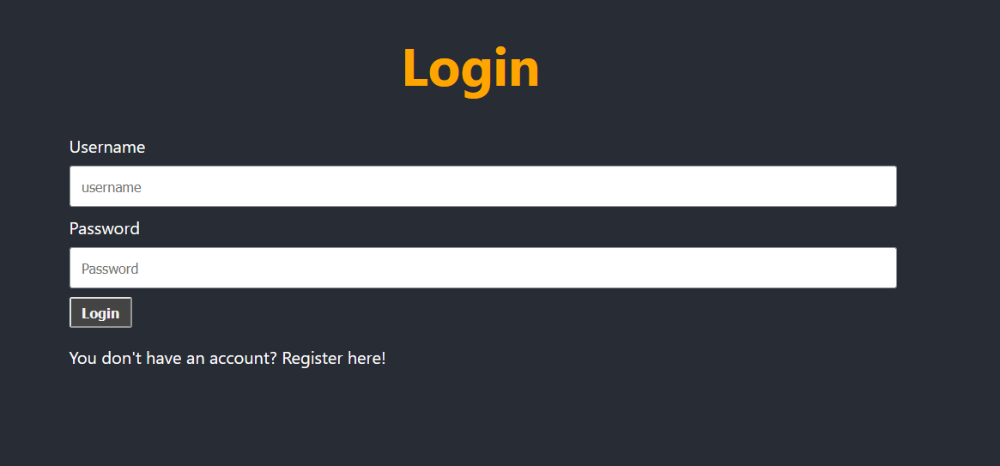
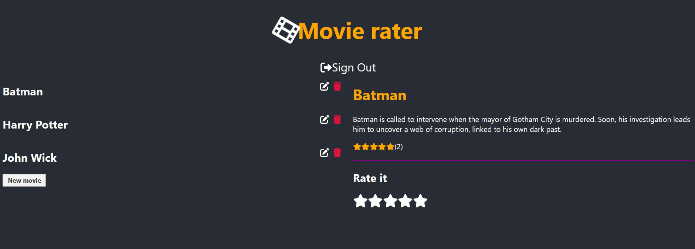
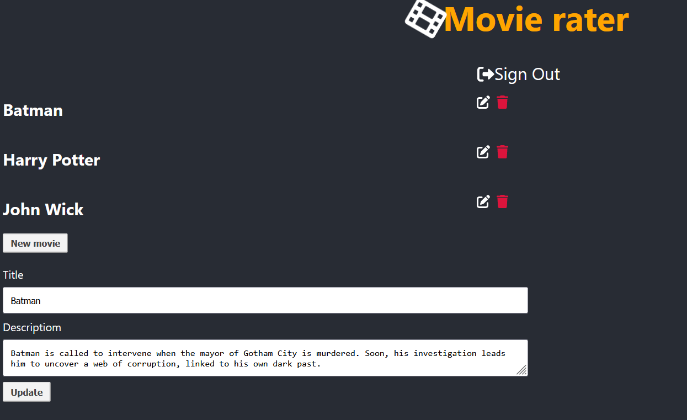
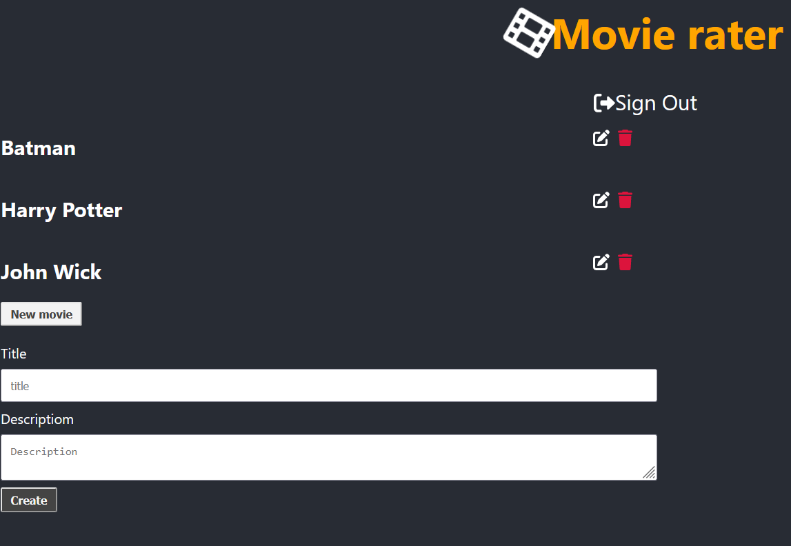

# Installation

- 1 - create a virtual environment and activate
- 2 - pip install virtualenv
- - virtualenv envname
- - envname\scripts\activate
- 3 - cd into project backend directory
- 4 - pip install -r requirements.txt 
- 5 - python manage.py runserver

# Features

- Building an API with Django REST Framework (DRF)
- Token based Authentication System
- Create, Update, Delete Movie
- Rating Feature

 # Tech Stack

- Django
- Django REST Framework
- React
- React Native

# Login Page

# Home Page

# Update Page

# Create Page

